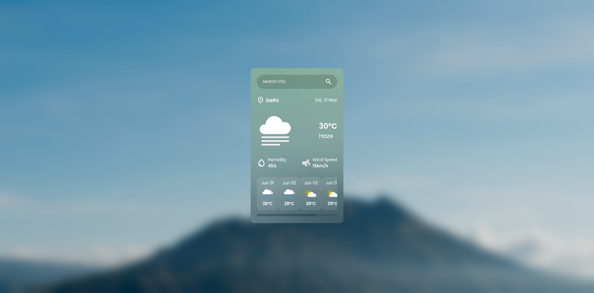

# Weather App ☀️🌧️

A beautiful and responsive weather application that provides current weather conditions and 5-day forecasts for cities worldwide. Built with vanilla JavaScript and featuring a modern glassmorphism design.



## ✨ Features

- **Current Weather Data**: Get real-time weather information for any city
- **5-Day Forecast**: View detailed weather predictions for the next 5 days
- **Beautiful UI**: Modern glassmorphism design with backdrop blur effects
- **Responsive Design**: Works seamlessly on desktop and mobile devices
- **Dynamic Weather Icons**: Custom SVG icons that change based on weather conditions
- **Search Functionality**: Easy city search with Enter key support
- **Error Handling**: User-friendly messages for invalid cities or network errors
- **Wind Speed & Humidity**: Detailed weather metrics display

## 🚀 Demo

Visit the live demo: **[https://weather-app-4vxw.vercel.app/](https://weather-app-4vxw.vercel.app/)**

## 🛠️ Tech Stack

- **Frontend**: HTML5, CSS3, Vanilla JavaScript
- **Backend**: Next.js API Routes
- **Deployment**: Vercel
- **API**: OpenWeatherMap API
- **Styling**: Custom CSS with Glassmorphism effects
- **Fonts**: Google Fonts (Poppins)
- **Icons**: Google Material Icons

## 📁 Project Structure

```
weather-app/
├── api/
│   └── [type].js              # Next.js API route for weather data
├── public/
│   ├── assets/
│   │   ├── bg.jpg            # Background image
│   │   ├── preview.png       # App preview screenshot
│   │   ├── message/
│   │   │   ├── not-found.png # City not found illustration
│   │   │   └── search-city.png # Search prompt illustration
│   │   └── weather/          # Weather condition SVG icons
│   │       ├── atmosphere.svg
│   │       ├── clear.svg
│   │       ├── clouds.svg
│   │       ├── drizzle.svg
│   │       ├── rain.svg
│   │       ├── snow.svg
│   │       └── thunderstorm.svg
│   ├── index.html            # Main HTML file
│   ├── script.js             # JavaScript functionality
│   └── style.css             # Styling and animations
├── package.json
├── .env.local                # Environment variables
└── .gitignore
```

## 🔧 Installation & Setup

### Prerequisites

- Node.js (v14 or higher)
- npm or yarn
- OpenWeatherMap API key

### 1. Clone the Repository

```bash
git clone https://github.com/Vedant1607/Weather-App.git
cd Weather-App
```

### 2. Install Dependencies

```bash
npm install
```

### 3. Get Your API Key

1. Visit [OpenWeatherMap](https://openweathermap.org/api)
2. Sign up for a free account
3. Generate your API key

### 4. Environment Setup

Create a `.env.local` file in the root directory:

```env
API_KEY=your_openweathermap_api_key_here
```

### 5. Run the Development Server

```bash
npm run dev
```

The app will be available at `http://localhost:3000`

## 🌐 API Endpoints

The app uses Next.js API routes to securely handle weather data requests:

### Current Weather
```
GET /api/weather?city={city_name}
```

### 5-Day Forecast
```
GET /api/forecast?city={city_name}
```

**Response Example:**
```json
{
  "name": "London",
  "main": {
    "temp": 22,
    "humidity": 65
  },
  "weather": [
    {
      "id": 800,
      "main": "Clear"
    }
  ],
  "wind": {
    "speed": 3.5
  }
}
```

## 🎨 Design Features

- **Glassmorphism UI**: Modern glass-like transparent elements
- **Backdrop Blur**: Beautiful blur effects for depth
- **Responsive Layout**: Adapts to different screen sizes
- **Smooth Animations**: Hover effects and transitions
- **Custom Scrollbar**: Styled scrollbar for forecast section
- **Dynamic Icons**: Weather-specific SVG illustrations

## 🔧 Usage

1. **Search for a City**: Type any city name in the search input
2. **View Current Weather**: See temperature, humidity, wind speed, and conditions
3. **Check Forecast**: Scroll through the 5-day forecast at the bottom
4. **Weather Icons**: Icons automatically update based on weather conditions

## 🚀 Deployment

This app is optimized for Vercel deployment:

### Deploy to Vercel

1. Fork this repository
2. Connect your GitHub account to Vercel
3. Import your forked repository
4. Add your `API_KEY` environment variable in Vercel dashboard
5. Deploy!

### Manual Deployment

```bash
npm run build
vercel --prod
```

## 🤝 Contributing

Contributions are welcome! Here's how you can help:

1. Fork the repository
2. Create a feature branch (`git checkout -b feature/amazing-feature`)
3. Commit your changes (`git commit -m 'Add amazing feature'`)
4. Push to the branch (`git push origin feature/amazing-feature`)
5. Open a Pull Request

### Development Guidelines

- Follow existing code style and structure
- Test your changes thoroughly
- Update documentation as needed
- Ensure responsive design principles

## 📝 License

This project is licensed under the ISC License. See the `LICENSE` file for details.

## 🙏 Acknowledgments

- [OpenWeatherMap](https://openweathermap.org/) for weather data API
- [Google Fonts](https://fonts.google.com/) for Poppins font family
- [Google Material Icons](https://fonts.google.com/icons) for UI icons
- [Vercel](https://vercel.com/) for hosting and deployment

## 📞 Support

If you have any questions or run into issues:

- Open an issue on GitHub
- Check the documentation
- Review the API documentation

### Features in Action
- **Search Functionality**: Instant city search with autocomplete
- **Weather Display**: Clean, easy-to-read weather information
- **Forecast Cards**: Scrollable 5-day forecast with hover effects
- **Error Handling**: User-friendly error messages

---

**Made with ❤️ by [Vedant1607](https://github.com/Vedant1607)**